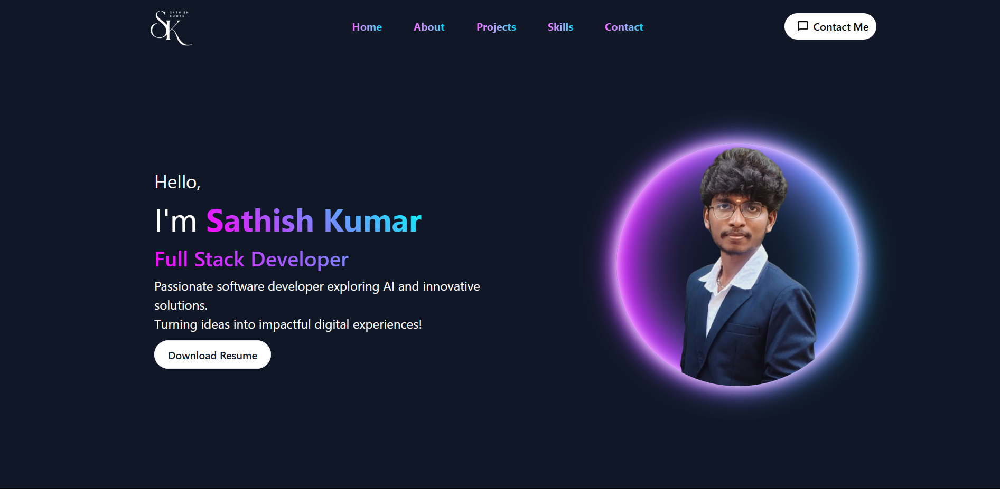

# Personal Portfolio Website

This is my personal portfolio website built using React and Vite. It showcases my skills, projects, and contact information.

## Live Demo

[View Portfolio](https://your-portfolio.netlify.app)

## Features

- Fully responsive design
- Smooth scrolling navigation
- Contact form with EmailJS integration
- Resume download option

## Technologies Used

- React.js (Frontend)
- Vite (Build tool)
- Tailwind CSS / Bootstrap (Styling)
- EmailJS (Contact form)
- Netlify (Deployment)

## Installation

1. Clone the repository
   ```sh
   git clone https://github.com/yourusername/yourportfolio.git
   ```
2. Navigate to the project folder
   ```sh
   cd yourportfolio
   ```
3. Install dependencies
   ```sh
   npm install
   ```
4. Start the development server
   ```sh
   npm run dev
   ```

## Environment Variables

Create a `.env` file in the root directory and add the following:

VITE_EMAILJS_SERVICE_ID="your_service_id"
VITE_EMAILJS_TEMPLATE_ID="your_template_id"
VITE_EMAILJS_PUBLIC_KEY="your_public_key"

## Screenshots


